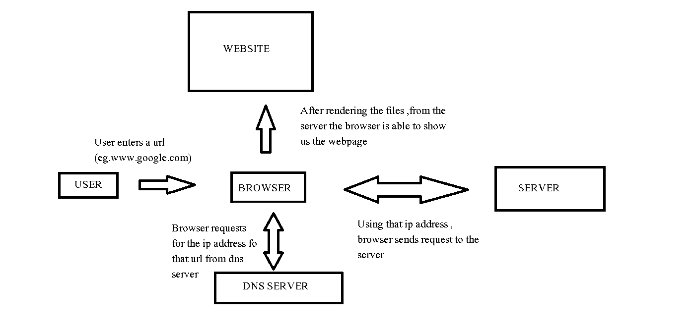
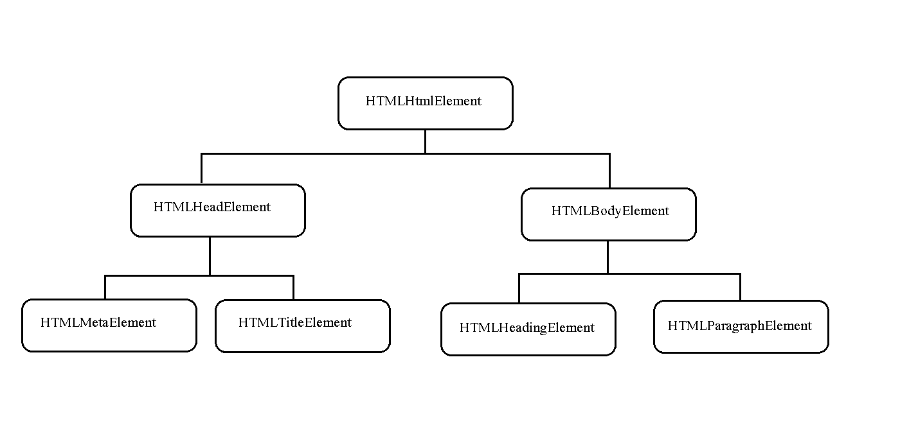

## *Working of a Web Browser

A web browser is a utility or an interface which helps user to access data which is there on remote servers.

Components of Browser

The main components of the browser are the address bar ,backward /forward button , refresh button , and opening and closing tabs.

When a user enters a URL in the browser , the browser interacts with the Domain Name System Server , and
gets back the ip address of that particular site. The browser then sends request to that remote server , and
recieves the respnse which contains the source code of the website.The browser renders the source code and
is able to regenerate the UI locally.

Rendering engine

The response which the browser recieves contains the html, css and javascript files.
The browser has also has a rendering enigne which is responsible for the visual representation of the webpage.It renders the html ,css  and javascript documnets and then displays the webpage.It also makes requests to the server in case any data is needed and also recieves response which contains the data.The requests are of various types like GET, POST ,PUT and DELETE.

The rendering page reads the html and constructs a document object model tree(DOM). DOM is a hierarchial tree of all the objects in the html. It is an interface between javacript and html/css.Using javascript we can access  properties and contents of all objects from html .This functionality can be used to read or update the content ,structure and style of the object. The DOM and CSSOM trees are combined to form the render tree. Render tree contains only the nodes required to render the page. Layout computes the exact position and size of each object. The last step is paint, which takes in the final render tree and renders the pixels to the screen.

This is the hierarchy for the below html code.

The html is a markup language and the html document is necessarily required as it makes the skeleton of the webpage .HTML contains various tags , which tells about what kind of data is present in the page , and if we have used the sementic tags correctly it helps the browser to find the relevant content easily.

whereas css document helps styling the webpage and javascript handles the interactive logic and functionality part in the webpage.

Storage in Browser

The browser also has local storage and session storage which helps in retaining user data which retains the state of the page in case it is refreshed or reopend.The data in the local storage is presistant and it stays even after closing the tab , whereas the data in the session storage persists only till the tab is open.
