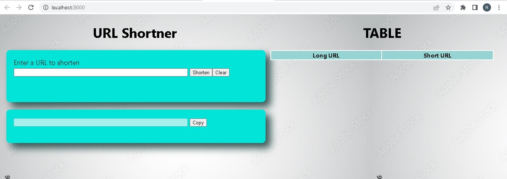
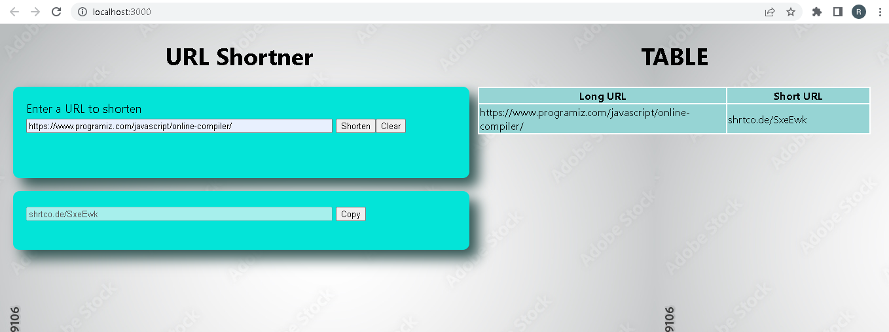

# Getting Started with Create React App

This project was bootstrapped with [Create React App](https://github.com/facebook/create-react-app).

## Available Scripts

In the project directory, you can run:

### `npm start`

Runs the app in the development mode.\
Open [http://localhost:3000](http://localhost:3000) to view it in your browser.

The page will reload when you make changes.\
You may also see any lint errors in the console.

### URL SHORTNER

This is the home page of URL Shortner Website.

User should populate the url to be shortened and click on Shorten button.The data will be populated in the table once data is fetched.

User can click on copy button to directly copy the shot url to clipboard , or click on clear to clear the input fields , and shorten another url.