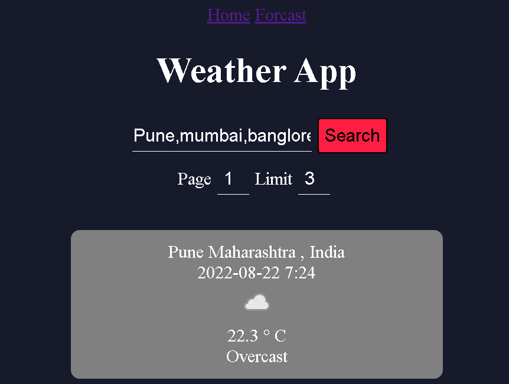
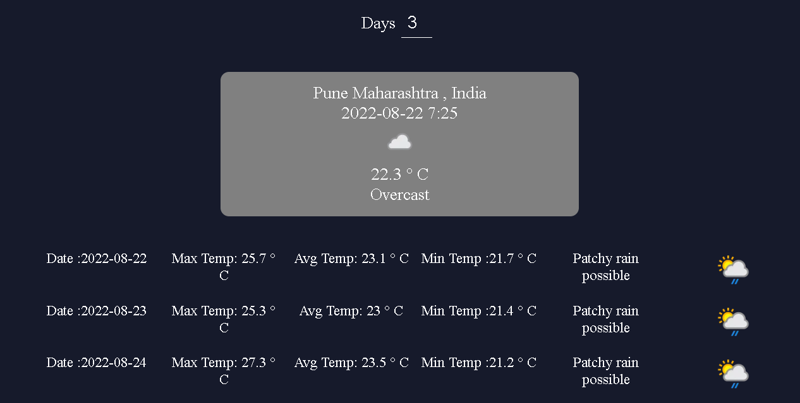

# Getting Started with Create React App

This project was bootstrapped with [Create React App](https://github.com/facebook/create-react-app).

## Available Scripts

In the project directory, you can run:

### `npm start`

Runs the app in the development mode.\
Open [http://localhost:3000](http://localhost:3000) to view it in your browser.

The page will reload when you make changes.\
You may also see any lint errors in the console.

## Week 13
###Assignment 1 Weather app

●Create a backend service in NodeJs.
●Design the architecture of your service.
●Understand what all Design Patterns you are gonna use in the service.
●Review above 2 points by your mentor
●Start Creating following Api's○Data of Multiple cities
■Api which returns weather data of multiple cities .
■Api also filters the result by city name or city code.
■Api should return the data in pagination.○Detailed Forecast for the next X days.
■X days should be decided by the user.
■Data should be very detailed.○Filter the data by any particular city, any particular date , anyparticular moment○Current weather conditions of any particular city
.●For Weather free api , please visit any of below free services○https://openweathermap.org/api
■Api Docs -https://openweathermap.org/api
■How to use -https://openweathermap.org/appid○https://www.weatherapi.com/
■Api Docs -https://www.weatherapi.com/docs/
■How to use -https://www.weatherapi.com/docs/
Guidelines:
●Before creating an api's review architect of your service and design pattern byyour Mentor.
●Push all your code in a separate Github repo.
●Don't push all your code in a single go.
●Don't push your code in the master branch. Create a separate branch for yourcode.
●Push your code every part wise.
●Get reviewed all your code by your mentor.
●After review, get your code merged by your mentor.

