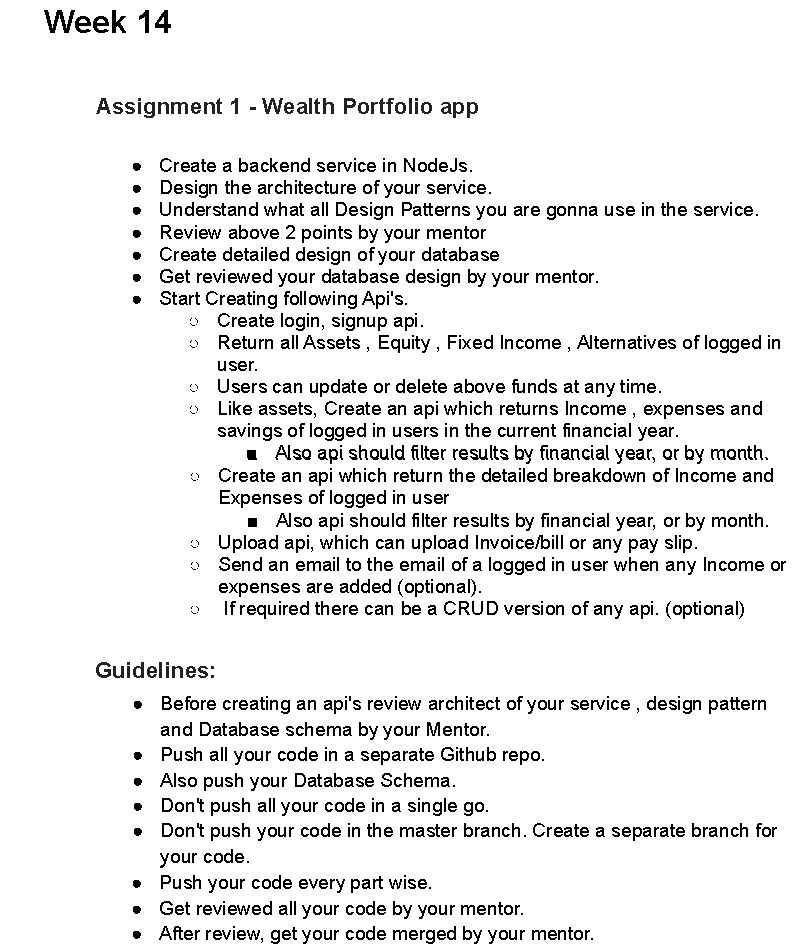

# Assignment 14.1

Use command npm start to run the application

1)For registering
TYPE OF REQUEST :POST
/api/register

BODY: {
     "fname":"Rahul",
    "lname":"sawant",
    "email":"rahul.saant@email.com",
    "username":"rahul.sawant",
    "password":"password@123"
}

2)For logging in
TYPE OF REQUEST :POST
/api/login
BODY: {
    "username":"rahul.sawant",
    "password":"password@123"
}

3)To add assets
TYPE OF REQUEST :POST
/api/holdings
BODY: {

        "asset_type": "FIXEDINCOME",
        "asset_id": "Rkhiugdic7428HG87",
        "asset_value": 200,
        "intrest_rate": 3,
        "invested_date": "2020-12-11T18:30:00.000Z",
        "invested_period_years": 5,
        "maturity_date": null,
        "status": "ACTIVE",
        "expense_type":"CREDIT"
    }
	
4)To fetch all assets
TYPE OF REQUEST :GET
/api/holdings

5)To fetch income, expenses and savings
TYPE OF REQUEST :GET
/api/holdings/stats

6)To fetch asset using asset_id
TYPE OF REQUEST :GET
/api/holdings/:id

7)To update asset using asset_id
TYPE OF REQUEST :PUT
/api/holdings/:id

BODY:{
		"asset_value": 200,
        "intrest_rate": 3,
        "invested_date": "2020-12-11T18:30:00.000Z",
        "invested_period_years": 5
	}
	
8)To activate asset using asset_id
TYPE OF REQUEST :PUT
/api/holdings/activate/:id

9)To inactivate asset using asset_id
TYPE OF REQUEST :PUT
/api/holdings/inactivate/:id