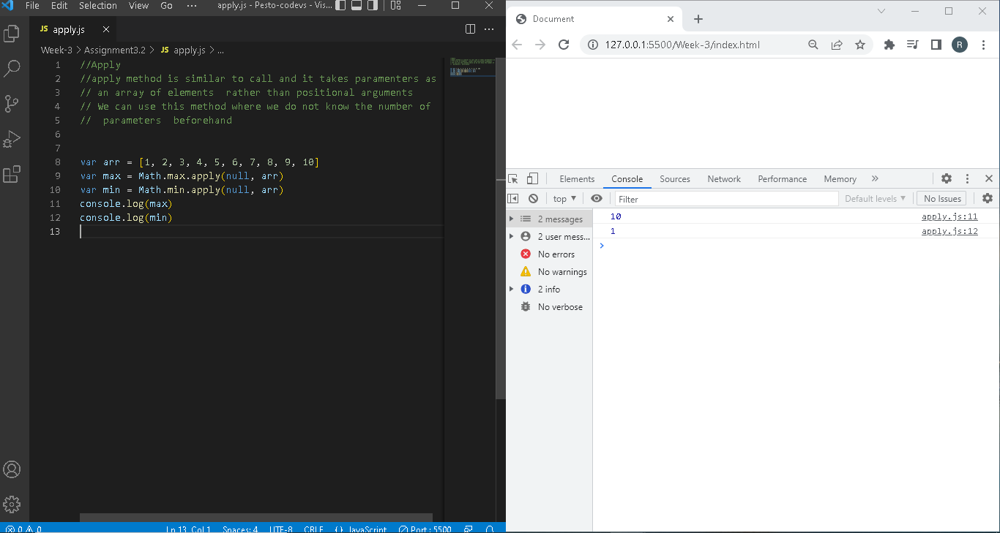

##*Assignment 3.2
Apply Function

Apply method is similar to call and it takes parameters as an array of elements  rather than positional arguments .We can use this method where we do not know the number of parameters  beforehand

Bind Function
Bind method creates a new function and permanently  binds the parameters passed to the function with 'this' value.

Call Function
Call function is used to bind a object to a function, the syntax for call function is functionname.call(args). The first argument always refers to the object which is being passed.If the function accepts any arguments , those can be passed from second argument onwards.
