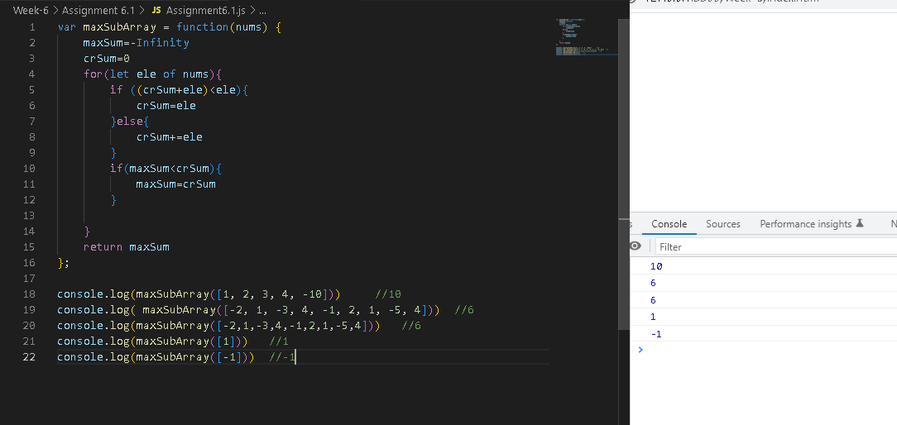

# Assignment 6.1
## Problem 6.1: Max Sum Contiguous Subarray
Find the contiguous subarray within an array, A of length N which has the largest sum.Input Format:The first and the only argument contains an integer array, A. Output Format: Return aninteger representing the maximum possible sum of the contiguous subarray.Constraints: 1 <= N <= 1e6 -1000 <= A[i] <= 1000 For example:Input 1: A = [1, 2, 3, 4, -10]Output 1: 10Explanation 1: The subarray [1, 2, 3, 4] has the maximum possible sum of 10.Input 2: A = [-2, 1, -3, 4, -1, 2, 1, -5, 4] Output 2: 6Explanation 2: The subarray [4,-1,2,1] has the maximum possible sum of 6.

