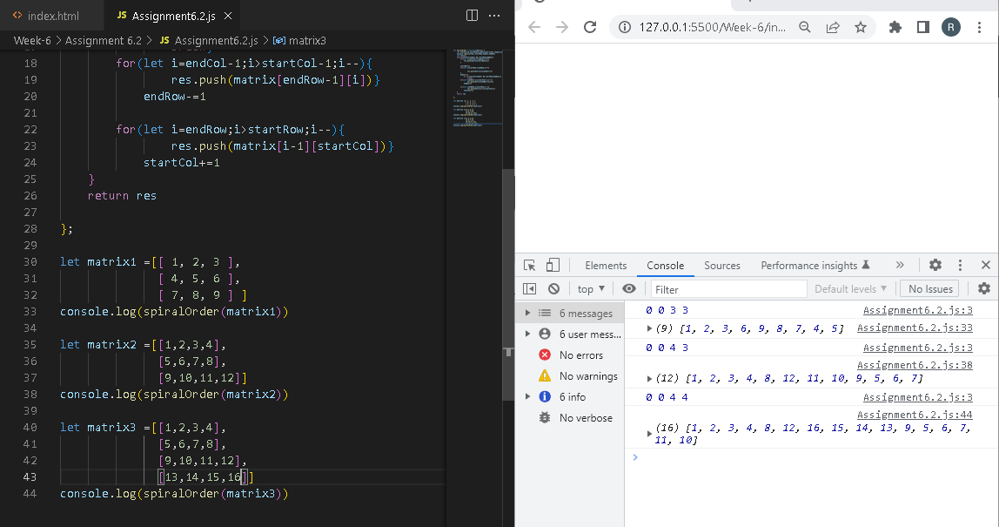

# Assignment 5.2
## Problem 6.2 Spiral Order Matrix II
Problem Description Given a matrix of m * n elements (m rows, n columns), return allelements of the matrix in spiral order.Example: Given the following matrix: [ [ 1, 2, 3 ], [ 4, 5, 6 ], [ 7, 8, 9 ] ] You should return[1, 2, 3, 6, 9, 8, 7, 4, 5]

