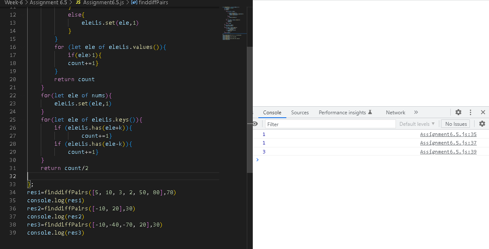

# Assignment 6.5
## Problem 6.5: Pair With Given Difference
Given an one-dimensional unsorted array A containing N integers.You are also given aninteger B, find if there exists a pair of elements in the array whose difference is B.Return1 if any such pair exists else return 0. Problem Constraints 1 <= N <= 105 -103 <= A[i]<= 103 -105 <= B <= 105Input Format First argument is an integer array A of size N. Second argument is aninteger B.Output Format Return 1 if any such pair exists else return 0.Example Input Input 1: A = [5, 10, 3, 2, 50, 80] B = 78 Input 2: A = [-10, 20] B = 30Example Output Output 1: 1 Output 2: 1Example Explanation Explanation 1: Pair (80, 2) gives a difference of 78. Explanation 2:Pair (20, -10) gives a difference of 30 i.e 20 - (-10) => 20 + 10 => 30
