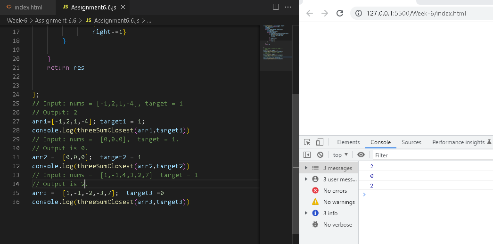

# Assignment 6.6
## Problem 6.6 : 3 sum
Given an array S of n integers, find three integers in S such that the sum is closest to agiven number, target.Return the sum of the three integers.Assume that there will only beone solutionExample: given array S = {-1 2 1 -4}, and target = 1. The sum that is closest to thetarget is 2. (-1 + 2 + 1 = 2)
