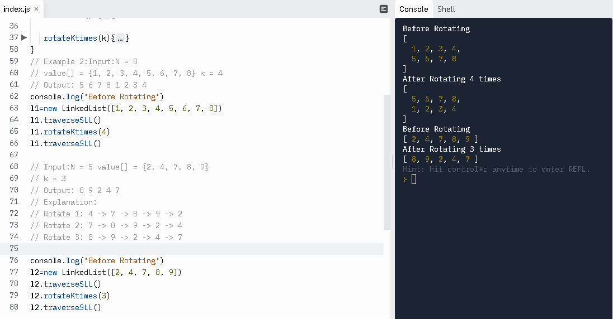

# Assignment 7.2
## Problem 7.2: Rotate Linked List
Given a singly linked list of size N. The task is to left-shift the linked list by k nodes,where k is a given positive integer smaller than or equal to length of the linked list.Example 1:Input:N = 5value[] = {2, 4, 7, 8, 9}k = 3Output: 8 9 2 4 7Explanation:Rotate 1: 4 -> 7 -> 8 -> 9 -> 2Rotate 2: 7 -> 8 -> 9 -> 2 -> 4
Rotate 3: 8 -> 9 -> 2 -> 4 -> 7Example 2:Input:N = 8value[] = {1, 2, 3, 4, 5, 6, 7, 8}k = 4Output: 5 6 7 8 1 2 3 4Expected Time Complexity: O(N). Expected Auxiliary Space: O(1).Constraints: 1 <= N <= 103 1 <= k <= N

